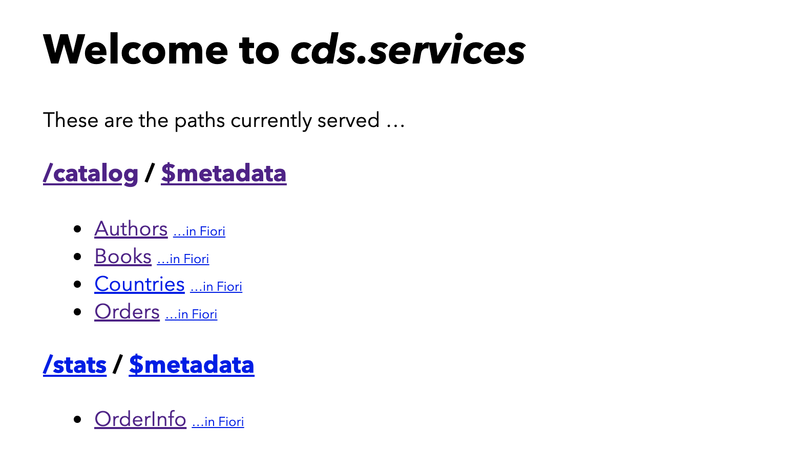
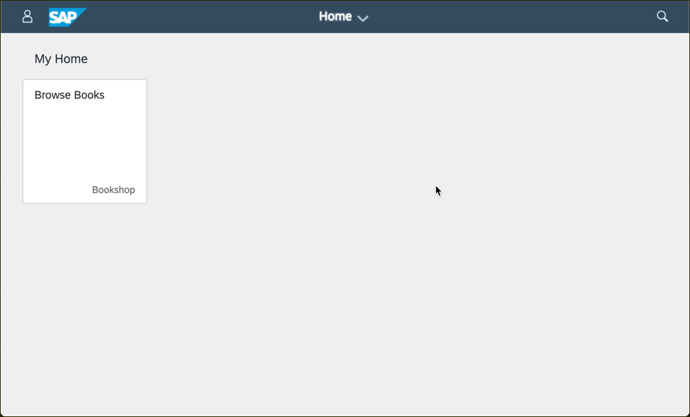
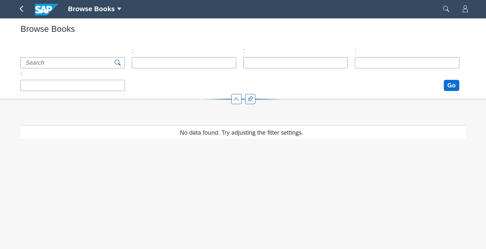

# Exercise 09 - Introducing an app at the UI layer

In this exercise you'll add a UI layer, by adding annotations that can drive aspects of a user interface (UI), and introducing a Fiori Elements based app.


## Steps

Following these steps, you'll build a simple Fiori app that sits in a local Fiori launchpad environment, and that serves up book details from the `CatalogService` OData service, helped by annotations that you'll be specifying.


### 1. Introduce a basic HTML page to be served for the UI

Following the "convention over configuation" theme, the Node.js flavored CAP model will also automatically serve static resources (such as UI artefacts) from a directory called `app/`.

If there isn't anything that can be sensibly served in the `app/` directory it will serve the "Welcome to cds.services" landing page we've seen already:



:point_right: Create the `webapp/` directory as a child of the existing `app/` directory, and create an `index.html` file within it, containing the following:

```html
<!DOCTYPE html>
<html>
<head>

    <meta http-equiv="X-UA-Compatible" content="IE=edge" />
    <meta http-equiv="Content-Type" content="text/html;charset=UTF-8" />
    <title>Bookshop</title>


</head>
<body class="sapUiBody" id="content"></body>
</html>
```

:point_right: Restart `cds watch` and go to the URL [http://localhost:4004/webapp](http://localhost:4004/webapp). Here, while the the page itself looks empty, there is the page title "Bookshop" in the browser tab, that shows us that the HTML we entered has been loaded:


### 2. Add a Fiori sandbox environment to the UI index page

Let's now add a bit more to the contents of the `index.html` file. To create a sandbox Fiori launchpad we'll need the UI5 runtime as well as artefacts from the `test-resources` area of the toolkit.

> While you have `cds watch` running, you may notice that it's not looking out for changes to HTML files, but that doesn't actually matter, as with HTML changes, the server doesn't need to be restarted. So you can make these following changes and simply switch over to the browser to refresh.

:point_right: Add these `script` elements between the `title` element and the end of the `head` element in `index.html`:

```html
    <script>
        window['sap-ushell-config'] = {
            defaultRenderer: 'fiori2',
            applications: {
            }
        };
    </script>

    <script
        src="https://sapui5.hana.ondemand.com/test-resources/sap/ushell/bootstrap/sandbox.js"></script>

    <script id="sap-ui-bootstrap"
        src="https://sapui5.hana.ondemand.com/resources/sap-ui-core.js"
    		data-sap-ui-libs="sap.m,sap.ushell,sap.fe.templates,sap.collaboration,sap.ui.layout"
    		data-sap-ui-compatVersion="edge"
    		data-sap-ui-theme="sap_fiori_3"
    		data-sap-ui-resourceroots='{"bookshop": "../"}'
        data-sap-ui-frameOptions="allow"></script>

    <script>
        sap.ui.getCore().attachInit(
            () => sap.ushell.Container.createRenderer().placeAt('content')
        )
    </script>
```

Here's a brief summary of what each of these `script` elements are for, in order of appearance in the file:

1. Basic configuration for the Fiori launchpad sandbox (otherwise known as the "universal shell" or "ushell")
1. Loading of the actual Fiori launchpad sandbox itself
1. Loading and bootstrapping of SAPUI5
1. Some JavaScript to declare a function to run when the initialization of SAPUI5 is complete; the function creates a launchpad and places it into the Document Object Model

Reloading the browser tab should now show the beginnings of something recognizable as a Fiori launchpad, like this:


### 3. Introduce a basic UI app to the Fiori launchpad

Now we have the launchpad as a container for our app, let's introduce it gradually.

The first thing to do is to add an entry to the sandbox launchpad configuration to define a tile and the app to which it should be connected.

:point_right: Do this by adding this "browse-books" section to the `applications` property in the "sap-ushell-config" - remember that this is inside the first `script` element in the file (context is shown):

```html
<script>
    window['sap-ushell-config'] = {
        defaultRenderer: 'fiori2',
        applications: {
            'browse-books': {                                        // <--
                title: 'Browse Books',                               // <--
                description: 'Bookshop',                             // <--
                additionalInformation: 'SAPUI5.Component=bookshop',  // <--
                applicationType : 'URL',                             // <--
                url: '/webapp'                                       // <--
            }                                                        // <--
        }
    };
</script>
```

Reloading the index page in the browser should show something like this:




### 4. Create the app artefacts

As we can see from the configuration we've just added, we're suggesting the app is a Component-based app (where the component name is "bookshop") and is to be found at (relative) URL `/webapp`. Let's flesh that out in terms of directories and files now.


:point_right: In the new `webapp/` directory, create a simple `Component.js` file (note the capitalization of the filename) with the following content:

```js
sap.ui.define(
    ['sap/fe/core/AppComponent'],
    ac => ac.extend('bookshop.Component', {
        metadata: {
            manifest: 'json'
        }
    })
)
```

This is a modern UI5 component definition that points to a JSON configuration file (a manifest).

:point_right: Create the corresponding manifest file `manifest.json` in the same directory as `Component.js`, with the following content:

```json
{
    "_version": "1.8.0",
    "sap.app": {
        "id": "bookshop",
        "type": "application",
        "title": "Browse Books",
        "description": "Sample Application",
        "i18n": "i18n/i18n.properties",
        "dataSources": {
            "CatalogService": {
                "uri": "/catalog/",
                "type": "OData",
                "settings": {
                    "odataVersion": "4.0"
                }
            }
        }
    },
    "sap.ui5": {
        "dependencies": {
            "libs": {}
        },
        "models": {
            "i18n": {
                "type": "sap.ui.model.resource.ResourceModel",
                "uri": "i18n/i18n.properties"
            },
            "": {
                "dataSource": "CatalogService",
                "settings": {
                    "synchronizationMode": "None",
                    "operationMode": "Server",
                    "autoExpandSelect": true,
                    "earlyRequests": true,
                    "groupProperties": {
                        "default": {
                            "submit": "Auto"
                        }
                    }
                }
            }
        },
        "routing": {
            "routes": [{
                    "pattern": "",
                    "name": "BooksList",
                    "target": "BooksList"
                },
                {
                    "pattern": "Books({key})",
                    "name": "BooksDetails",
                    "target": "BooksDetails"
                }
            ],
            "targets": {
                "BooksList": {
                    "type": "Component",
                    "id": "BooksList",
                    "name": "sap.fe.templates.ListReport",
                    "options": {
                        "settings": {
                            "entitySet": "Books",
                            "navigation": {
                                "Books": {
                                    "detail": {
                                        "route": "BooksDetails"
                                    }
                                }
                            }
                        }
                    }
                },
                "BooksDetails": {
                    "type": "Component",
                    "id": "BooksDetails",
                    "name": "sap.fe.templates.ObjectPage",
                    "options": {
                        "settings": {
                            "entitySet": "Books"
                        }
                    }
                }
            }
        }
    }
}

```

Now you can open the "Browse Books" app and see the beginnings of a list report.




### 5. Create a CDS index file with annotations

This is the point where you can introduce an `index.cds` file which controls which services are exposed, and also which can contain annotations to drive the Fiori elements based app.

:point_right: Create a file `index.cds` in the `srv/` directory, and initially add this single line, which brings in the service definitions defined in `service.cds`:

```cds
using from './service';
```

Now let's look at important content that will help us join together in our minds the two complementary worlds of CAP and Fiori. This content is to be added next to `index.cds` and controls what gets served to Fiori frontends, via annotations that form a rich layer of metadata over the top of the service.

:point_right: Below the initial `using from ...` line, add the following content:

```cds
annotate CatalogService.Books with @(
    UI: {
        Identification: [ {Value: title} ],
        SelectionFields: [ title ],
        LineItem: [
            {Value: ID},
            {Value: title},
            {Value: author.name},
            {Value: author_ID},
            {Value: stock}
        ],
        HeaderInfo: {
            TypeName: '{i18n>Book}',
            TypeNamePlural: '{i18n>Books}',
            Title: {Value: title},
            Description: {Value: author.name}
        }
    }
);

annotate CatalogService.Books with {
    ID @title:'{i18n>ID}' @UI.HiddenFilter;
    title @title:'{i18n>Title}';
    author @title:'{i18n>AuthorID}';
    stock @title:'{i18n>Stock}';
}

annotate CatalogService.Authors with {
    ID @title:'{i18n>ID}' @UI.HiddenFilter;
    name @title:'{i18n>AuthorName}';
}
```

> You may see some warnings that there are no texts for the internationalization (i18n) identifiers. We'll fix this shortly, you can ignore the warnings for now.


### 6. Test the app

The app should be ready to invoke. Reload the Fiori launchpad and select the tile. It should open up into a nice List Report style Fiori Elements app - all driven from the service's annotations:


Well done!


### 7. Add base internationalization texts

Just to round things off, add some i18n texts - they're referred to in various annotation sections, and it will make the app look a little more polished.

:point_right: Create a directory called `i18n/` as a direct child of the `srv/` directory, and create a file `i18n.properties` inside it, with the following content:
```
ID=ID
Title=Title
Stock=Stock Available
AuthorID=Author ID
AuthorName=Author Name
Book=Book
Books=Books
```

:point_right: After the `cds watch` mechanism has restarted the server, refresh the app, and you should see the static texts as specified in the `i18n.properties` file, such as "Author Name" rather than "AuthorName".


## Summary

While this was a little intense as far as creation of artefacts was concerned, we hope you agree that for little effort, and based on a great foundation, a lot can be achieved!

## Questions

1. Why do we put the internationalization file in the `srv/` directory (rather than the `app/` directory)?
<!-- while it's common to have i18n in UI5 apps, here we are annotating the service and not the UI, i.e. the translatable parts are related to the OData service and annotations, not the controls in the UI -->

