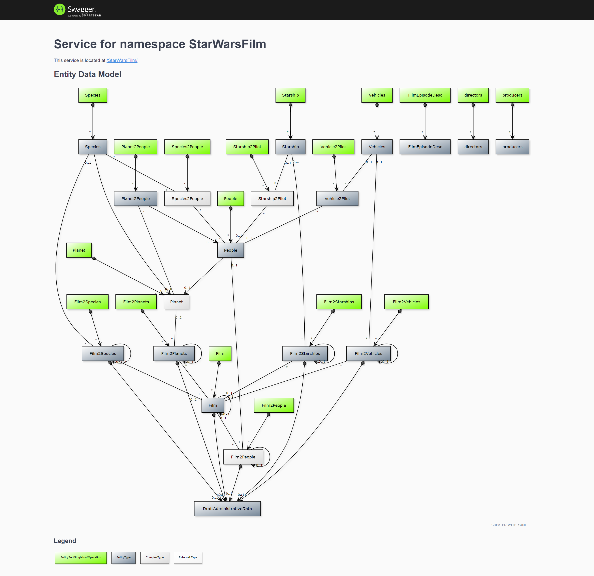
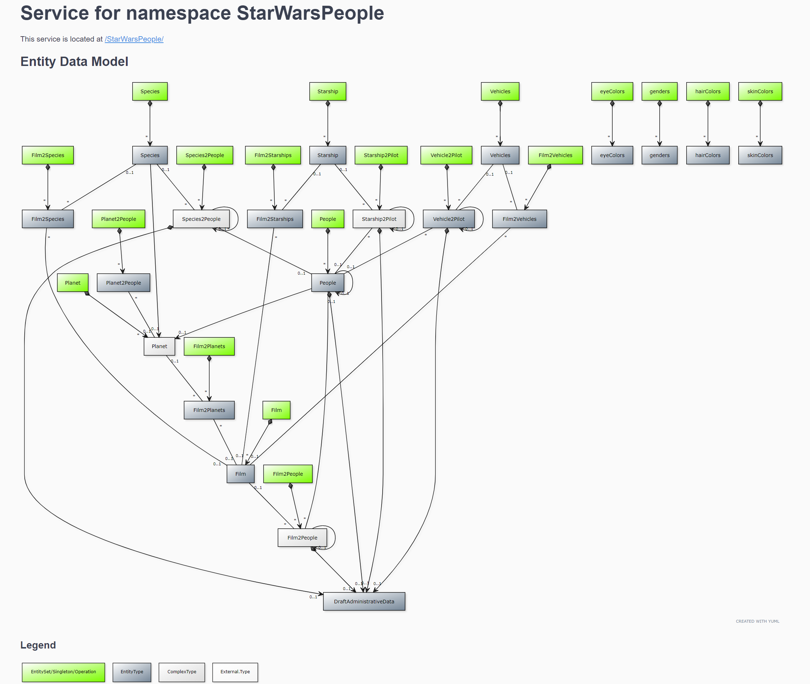
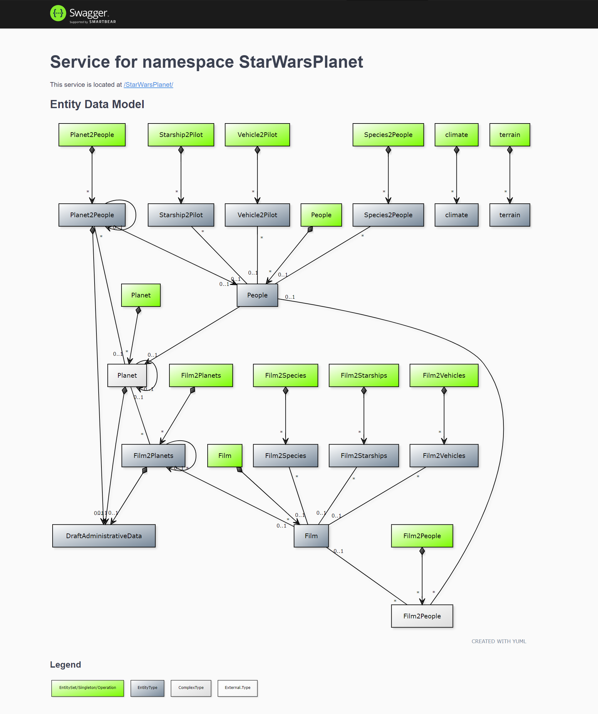
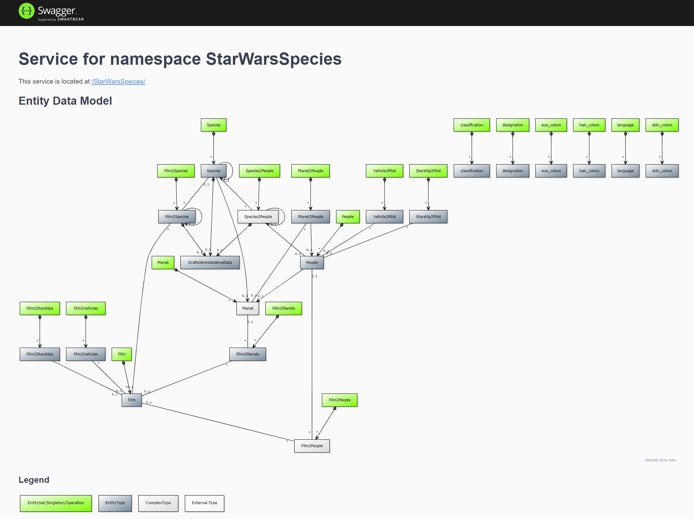
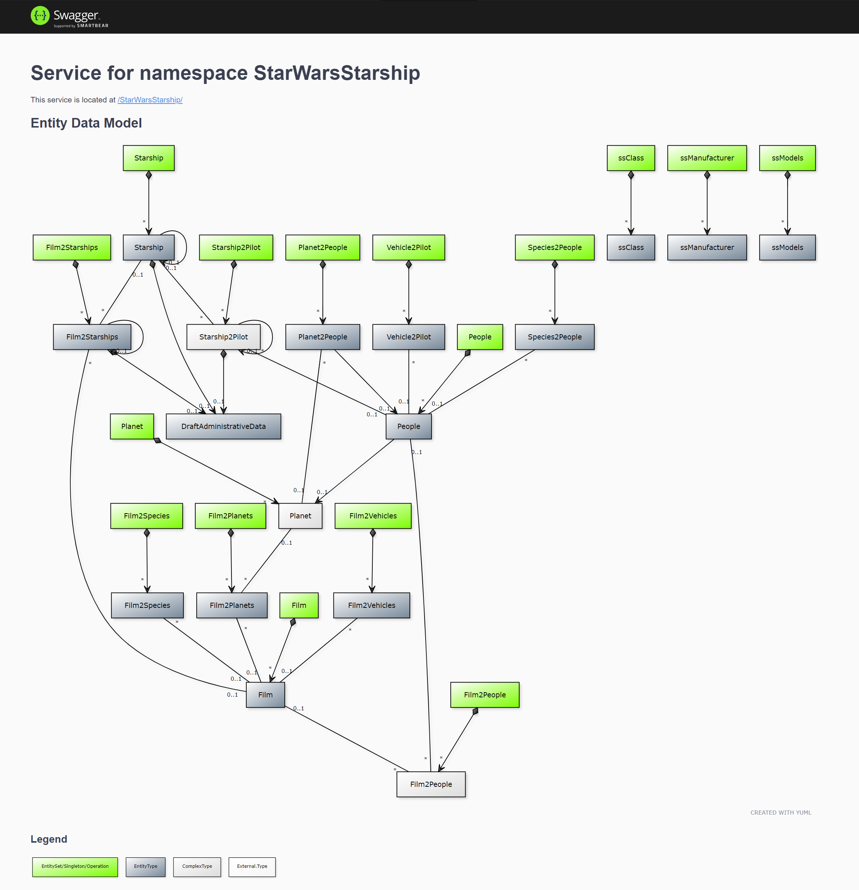
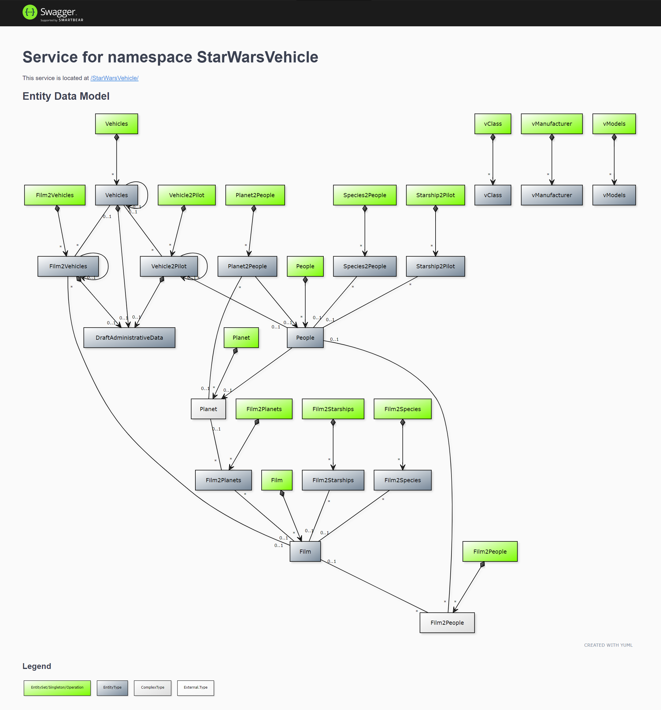
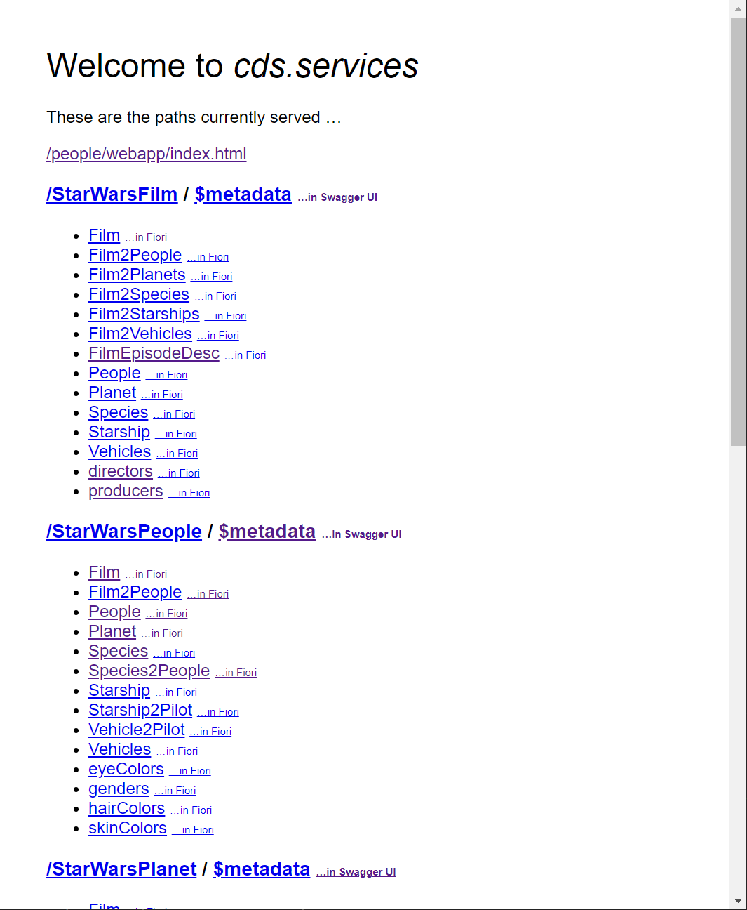
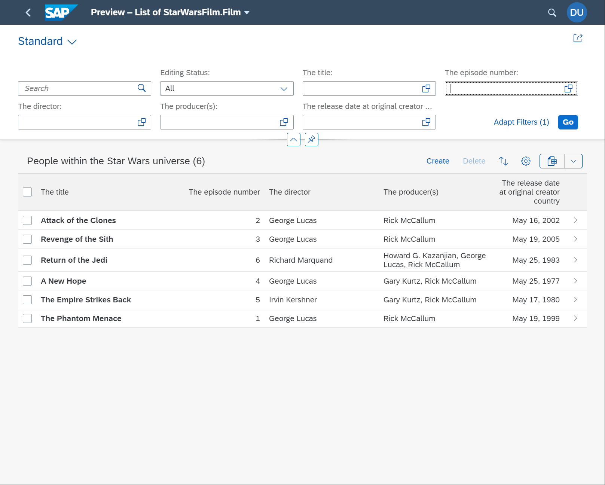
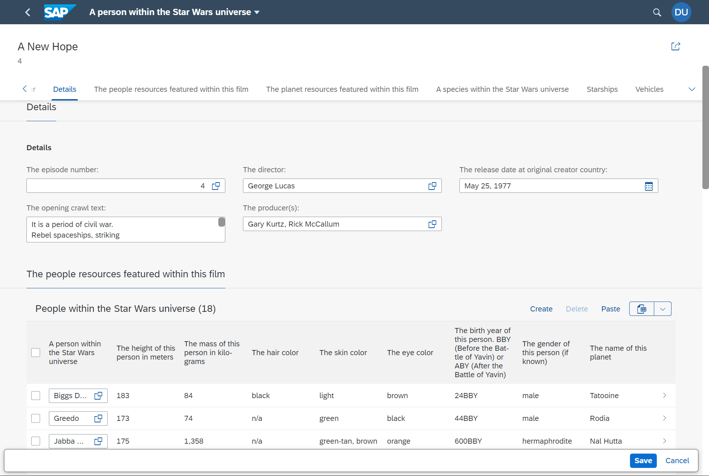

# cloud-cap-hana-swapi - bi-directional, many-to-many SAP Cloud Application Programming Model example

# Same as SAP's repo from Thomas Jung but have adjustments for data load into sqlite instead of HANA

[](https://api.reuse.software/info/github.com/SAP-samples/cloud-cap-hana-swapi)
[](https://open.vscode.dev/SAP-samples/cloud-cap-hana-swapi)

## Description

SWAPI - the Star Wars API. This sample is based upon the sample at [swapi.dev](https://swapi.dev/) which in turn was based upon [swapi.co](https://swapi.dev/about). The original source can be found at [https://github.com/Juriy/swapi](https://github.com/Juriy/swapi).

The original project was a data set and data model based in Python that exposed data from the Star Wars movies sourced originally from the community wiki: [Wookiepedia](https://starwars.fandom.com/wiki/Wookieepedia). It encompasses data about the People, Films, Species, Starships, Vehicles and Planets from Star Wars.

The projects described above have fallen out of maintenance but still offered the opportunity for a fun yet challenging learning experience from a non-trivial data model. The many bi-directional, many-to-many relationships with the data provides a good basis for an SAP Cloud Application Programming Model and Fiori Draft UI sample.

### Data Model

#### Films



#### People



#### Planets



#### Species



#### Starships



#### Vechicles



## Requirements

* [SAP Cloud Application Programming July 2021 (5.3.0) or higher](https://cap.cloud.sap/docs/releases/july21)
* [Node.js 12 or 14](https://nodejs.org/en/)
* [Swagger UI for Express](https://www.npmjs.com/package/swagger-ui-express)

## Download and Installation

The original data model and data source files are in in the [oldPython\resources](./oldPython/resources/) folder.

The rest of the operations can be performed within the [cap](./cap/) folder and there are scripts in the [package.json](./cap/package.json#L20) file major operations.

You can use `npm run build` to perform the cds build and should be ran before deployment to HANA or whenever you make changes to the data model.

You can run `npm run hana` to deploy the content to your HANA database.  Just be sure from the terminal that you are logged into the cf/xs cli and targeting the Account/Org/Space where you want the content to live. By default this command will create an HDI Container instance named **starwars**.

You can run the command `npm run load`. This command will read the original JSON data files from the source project and load them into your HANA database using Cloud Application Programming Model [CQL](https://cap.cloud.sap/docs/cds/cql). The loading script is [convertData.js](./cap/convertData.js)

The command `npm start` or `cds run` will start the service running locally. It will open the standard CAP test page where you can explore the OData Services or the Fiori UI.

From the Cloud Application Programming Model preview (which opens locally when using `npm start` or `cds run`), you can access the Swagger UI test tool (with entity diagrams), test the OData services or metadata calls directly in the browser, or access the Fiori preview UI for each of the main entities.







## Known Issues

If you receive an error like the following when running the convertData script

```json
[Error: SQLITE_BUSY: database is locked] {
  errno: 5,
  code: 'SQLITE_BUSY',
  query: 'DELETE FROM star_wars_People'
}
```

This is caused by the parallel nature of the loading of the data in SQLite.  The default script with its parallel loading works fine when you use HANA as the target persistence. However if you are using SQLite for your tempoary testing persistence, then you can use the alternative convertDataLite script instead. 

## How to obtain support

This project is provided "as-is": there is no guarantee that raised issues will be answered or addressed in future releases.

## License

Copyright (c) 2020 SAP SE or an SAP affiliate company. All rights reserved. This project is licensed under the Apache Software License, version 2.0 except as noted otherwise in the [LICENSE](LICENSES/Apache-2.0.txt) file.

Star Wars and all associated names are copyright Lucasfilm ltd. All data in this sample has been freely collected from open sources such as [Wookiepedia](https://starwars.fandom.com/wiki/Wookieepedia) under [CC-BY-SA](https://creativecommons.org/licenses/by-sa/3.0/legalcode) .
